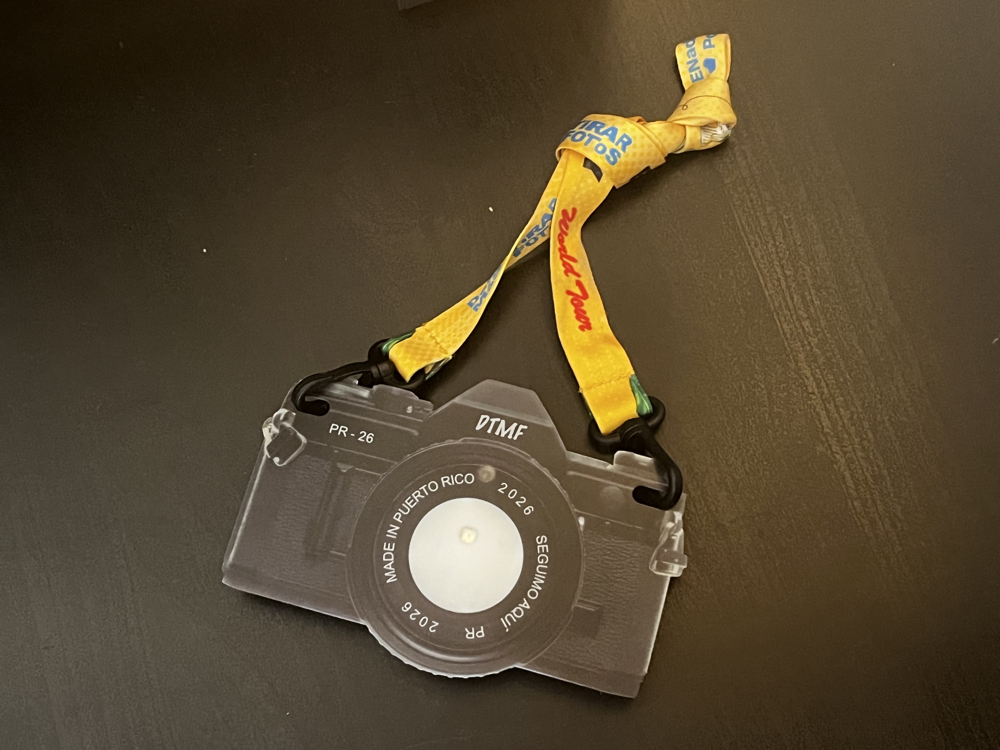
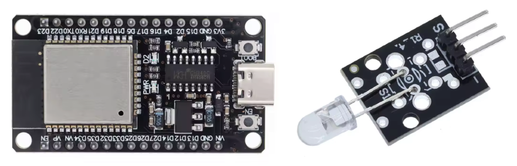
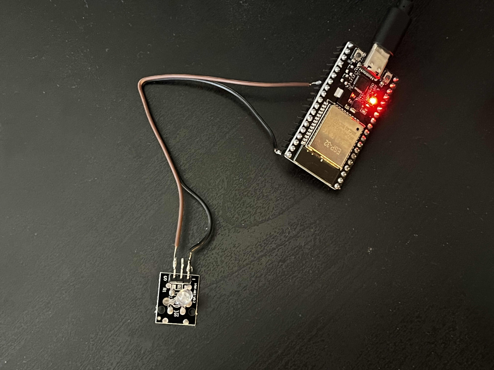
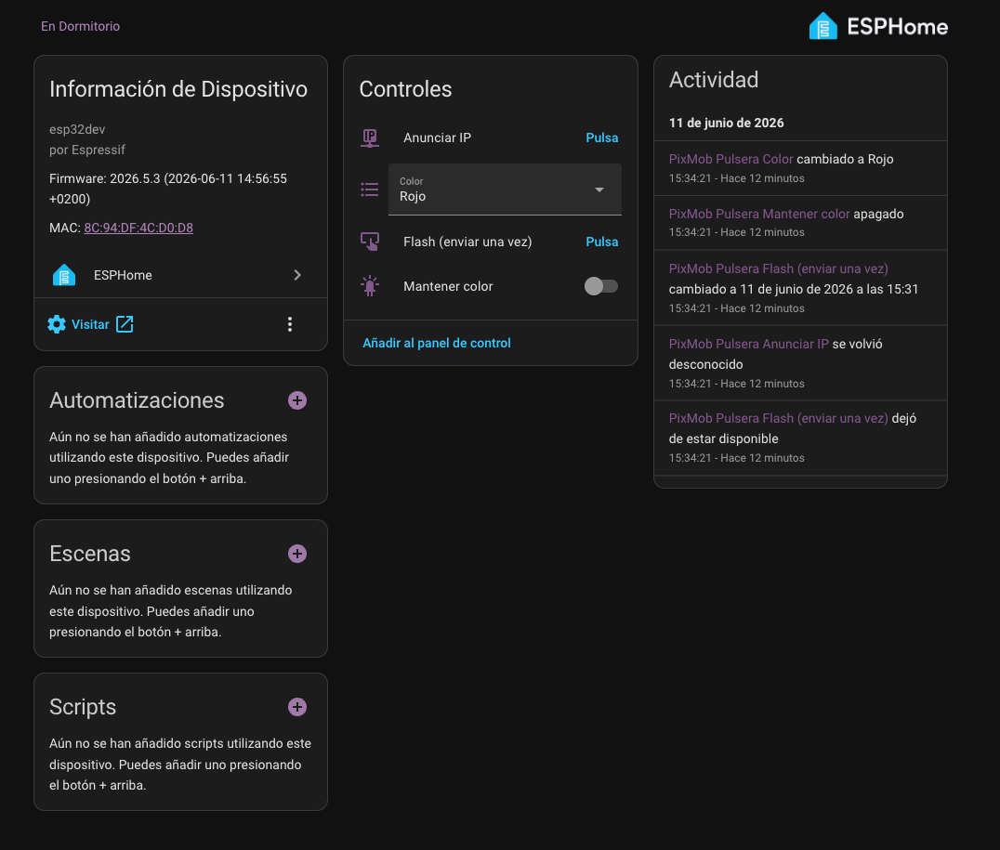
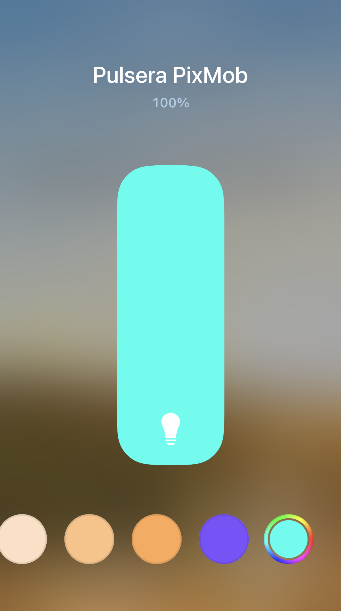

# PixMob ESP32 — Revivir la cámara del concierto de Bad Bunny

> **Versión 0.5 — provisional.** El proyecto funciona de principio a fin, pero todavía estoy verificando qué códigos de color responden bien en mi modelo de cámara. Esta documentación irá evolucionando.

Fui al concierto de Bad Bunny en Madrid y, como a todo el mundo, me dieron una camarita LED PixMob que se ilumina sincronizada durante el show mediante señales infrarrojas. Al acabar el concierto la cámara se queda muerta en un cajón... y eso no podía ser. Así que la he convertido en una **bombilla domótica**: controlable desde Home Assistant, desde la app Casa de Apple (con Siri incluido) y desde una interfaz web propia en mi LAN.



## Cómo funciona

Las cámaras PixMob llevan un receptor de infrarrojos y LEDs RGB. Durante el concierto, unos emisores IR gigantes apuntan al público y mandan los comandos de color/efecto. El protocolo está reverseado gracias al trabajo de la comunidad en [danielweidman/pixmob-ir-reverse-engineering](https://github.com/danielweidman/pixmob-ir-reverse-engineering):

- **No es un protocolo IR estándar** (nada de NEC ni RC5): son señales raw con portadora de **38 kHz** donde cada bit dura **~700 µs**.
- Cada código produce un **flash breve** en la cámara. Para mantener un color fijo hay que **retransmitir el código continuamente** — exactamente lo que hacen en los conciertos.
- Hay códigos de colores sólidos, fades, efectos probabilísticos (el "twinkle" que se ve en los shows), etc.

Mi montaje: una **ESP32** con un **emisor IR KY-005** corriendo **ESPHome**, que expone la cámara como entidades en Home Assistant y de ahí, vía HomeKit Bridge, como bombilla RGB en Apple Home.

```
Apple Home / Siri ──► HomeKit Bridge ──► Home Assistant ──► ESPHome (ESP32) ──► IR 38kHz ──►  Cámarita
```

## Hardware

| Componente | Precio aprox. | Link |
|---|---|---|
| ESP32 DevKitC (WROOM-32, CP2102, USB-C) | ~4 € | https://es.aliexpress.com/item/1005005972312714.html?gatewayAdapt=glo2esp |
| Módulo emisor IR KY-005 (LED 940 nm) | ~1 € | https://es.aliexpress.com/item/1005006787974005.html?gatewayAdapt=glo2esp |
| cámara PixMob | gratis con tu entrada | — |



Elegí la versión con chip USB **CP2102** en vez de CH340 porque da menos guerra con drivers (en mi Mac funcionó sin instalar nada). Y el KY-005 porque es un emisor "tonto" sin lógica propia: lo controlas directamente desde un GPIO. Ojo con los módulos tipo "transceptor IR con WiFi y protocolo NEC" — esos llevan su propio microcontrolador y NO sirven para esto.

### Cableado

Más simple imposible:

```
KY-005          ESP32
S (signal)  →   GPIO4 (P4/D4)
- (GND)     →   GND
pin central →   sin conectar
```


A distancia de habitación (2-4 m) el GPIO mueve el LED de sobra sin transistor. Si quisiera cubrir una sala entera, añadiría un transistor 2N2222 con un LED de más potencia (TSAL6400), pero para mi caso no hace falta.

## Software

Todo corre sobre **ESPHome**, que me da gratis: integración nativa con Home Assistant, actualizaciones OTA, e interfaz web propia en la IP de la ESP32.

### Archivos del repo

- `pixmob.yaml` — configuración completa de ESPHome
- `pixmob_codes.h` — los códigos PixMob convertidos a raw timings (generados desde las definiciones del repo de danielweidman)
- `pixmob_standalone/` — plan B: sketch Arduino independiente con servidor web y API HTTP, por si no quieres usar ESPHome

### Conversión de los códigos

Los códigos del repo original están como arrays de bits (`[1, 1, 0, 0, 1, 0, ...]`). Para ESPHome los convertí a raw timings: se agrupan los bits consecutivos iguales y se multiplican por 700 µs, alternando marca (positivo) y espacio (negativo). Por ejemplo `[1,1,0,0,1]` → `[+1400, -1400, +700]`. Cada transmisión se repite 3 veces con 7 ms de separación para mejorar la fiabilidad.

### Flasheo inicial

```bash
pip3 install esphome
# secrets.yaml con wifi_ssid / wifi_password (y *_2 para la segunda red)
esphome run pixmob.yaml
# Primera vez: por USB. Las siguientes: OTA sin cable.
```

### Entidades que aparecen en Home Assistant

- `select.pixmob_color` — selector con los 19 efectos (10 colores sólidos + 9 fades). Al cambiarlo ya transmite.
- `button.pixmob_flash_enviar_una_vez` — reenvía el efecto seleccionado
- `switch.pixmob_mantener_color` — retransmite cada 900 ms para dejar el color fijo
- `button.pixmob_anunciar_ip` — ver siguiente sección 👇



## 🛰️ Feature: la cámara "canta" su IP

Mi parte favorita. Como la ESP32 puede acabar en redes distintas (tengo dos WiFis configuradas), al arrancar y conectarse anuncia el último octeto de su IP **parpadeando la cámara**:

- 🟢 **Verde** = centenas
- 🔴 **Rojo** = decenas
- 🔵 **Azul** = unidades

Ejemplo: si pilla la `192.168.1.156` → 1 flash verde, pausa, 5 flashes rojos, pausa, 6 flashes azules. Si un dígito es 0, ese color se salta. Cero pantallas, cero `nmap` para encontrarla: enchufas, miras la cámara, y ya sabes dónde está.

## Integración con Apple Home (HomeKit)

HomeKit no soporta entidades `select` de HA, así que el truco es una **luz template** que traduce cualquier color RGB que elijas en la rueda de Apple Home al color PixMob más cercano (distancia euclídea en RGB) y activa la retransmisión. La config está en [`homeassistant/configuration_light.yaml`](homeassistant/configuration_light.yaml) <!-- ajusta la ruta si lo organizas distinto -->.

Resultado: en la app Casa aparece "cámara PixMob" como bombilla de color normal y corriente. *"Oye Siri, pon la cámara en verde"* — y funciona.



## Problemas que me encontré (para que tú no pierdas el tiempo)

1. **El módulo IR equivocado.** Estuve a punto de comprar un "transceptor IR WiFi con protocolo NEC" pensando que era un simple emisor. No: es un dispositivo autónomo con su propia lógica. Para este proyecto necesitas un emisor tonto (KY-005 o un LED IR pelado).


2. **WiFi con señal débil.** La primera red a la que intenté conectarla estaba a -84 dB y la ESP32 fallaba con `4-Way Handshake Timeout` en bucle. Lo parece pero no es un error de contraseña: es cobertura. Solución: configurar **múltiples redes** en ESPHome y que elija la de mejor señal. Recuerda además que la ESP32 solo ve redes de **2.4 GHz**.

3. **API de ESPHome desactualizada.** Para leer la IP en una lambda, `wifi_sta_ip()` ya no existe en versiones recientes de ESPHome; ahora es `get_ip_addresses()`. El YAML del repo ya lo lleva corregido.

4. **`esphome config` no compila las lambdas.** La validación del YAML pasa aunque el C++ de las lambdas esté mal — eso solo revienta al compilar de verdad. Que no te dé falsa confianza.

## Roadmap

- [ ] **v0.6** — Verificar qué códigos funcionan de forma fiable en mi modelo de cámara y depurar la lista (ahora mismo hay efectos que pueden no responder)
- [ ] Generar códigos a medida con el protocolo completo decodificado en [jamesw343/PixMob_IR](https://github.com/jamesw343/PixMob_IR)
- [ ] Automatizaciones del homelab: alertas de Suricata en rojo, backups OK en verde
- [ ] Quizá: transistor + LED de potencia para cubrir toda la habitación

## Créditos

- [danielweidman/pixmob-ir-reverse-engineering](https://github.com/danielweidman/pixmob-ir-reverse-engineering) — el reverse engineering del protocolo y los códigos. Todo el mérito del protocolo es suyo y de la comunidad PIXMOD.
- [jamesw343/PixMob_IR](https://github.com/jamesw343/PixMob_IR) — decodificación completa del protocolo IR.
- [ESPHome](https://esphome.io) — el firmware que hace que todo esto sean 150 líneas de YAML y no un proyecto de tres fines de semana.

## Licencia

MIT — como el proyecto original del que derivan los códigos.
